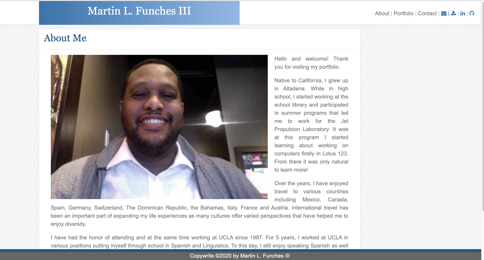
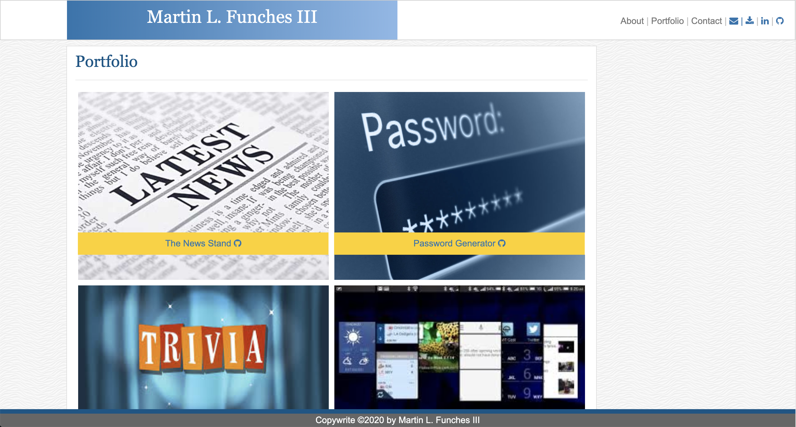
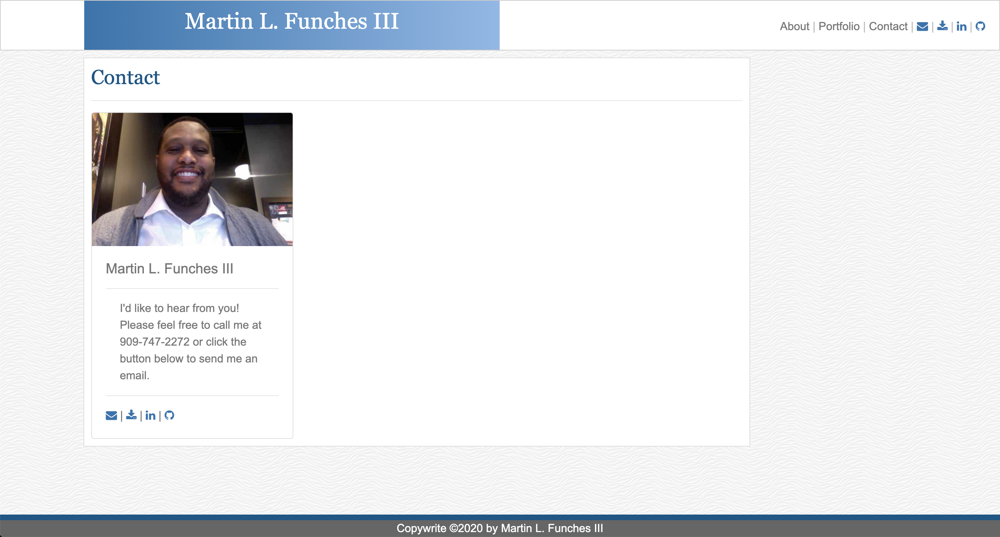

# MyPortfolio
Update Portfolio

This project was to create a simple, clean portfolio.

Requirements:
Updated portfolio featuring project 1 and two exemplary homework assignments.
Update GitHub profile with pinned repositories featuring project 1 and two exemplary assignments.
Updated resume
Updated LinkedIn profile

Content:
Your name
Links to your GitHub profile & LinkedIn page as well as your email address and phone number
A link to a PDF of your resume

A list of projects. For each project, make sure you have the following:
Project title
Link to the deployed version
Link to the GitHub repository
Screenshot of the deployed application

Design
Unfortunately, this is where it gets a little bit subjective. Your site should look
"polished." Here are a few guidelines on what that means:

Mobile-first design

Choose a color palette for your site so it doesn't just look like
the default bootstrap theme or an unstyled HTML site.

Make sure the font size is large enough to read, and that the colors don't cause eye strain.

